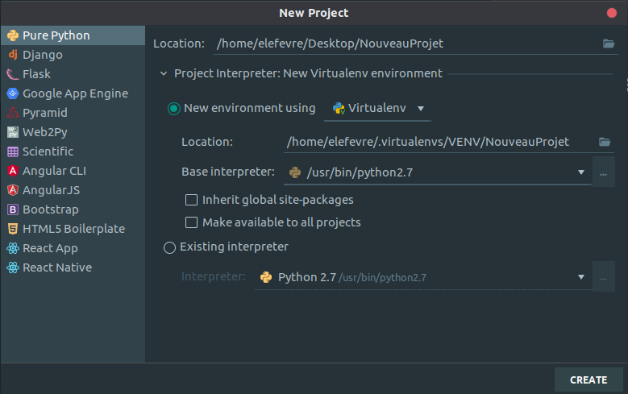

# Environements Virtuels

## Conda


## Virtualenv et virtualenvwrapper

Virtualenv est une librairie permettant de créer des environements virtuels python, cependant, la semantique de cette
librairie n'est pas très pratique, virtualenvwrapper à donc été crée pour simplifier l'usage de la librairie.

### Installation
```shell script
pip3 install virtualenv 
pip3 install virtualenvwrapper 
```

Ajouter ces lignes à la fin du fichier ~/.bashrc : 
```
export WORKON_HOME=$HOME/.virtualenvs
export PROJECT_HOME=$HOME/Devel
source /usr/local/bin/virtualenvwrapper.sh
```

Et : 
```shell script
source ~/.bashrc
```

Si après le source une erreur no such file or directory apparait : 
```shell script
sudo find / -name virtualenvwrapper.sh
```
Recopier le path du ficher dans le bashrc à la place de `/usr/local/bin/virtualenvwrapper.sh`

### Usage
```shell script
mkvirtualenv env_name # create env
workon env_name # activate env (autocompletion with tab, allow to see all availiable envs) 
deactivate # quit env
```
Une fois l'environement activé, le nom apparaît entre parenthèse en début de ligne dans le terminal : 
`(env_name) user@machine :~$`

## Pycharm

Lors de la création d'un nouveau projet dans PyCharm, cette fenêtre s'ouvre.



`Il faut surtout être attentif à la version de python selectionnée (Base Interpreter).`

L'IDE laisse également la possibilité d'utiliser un environement virtuel déjà existant.  