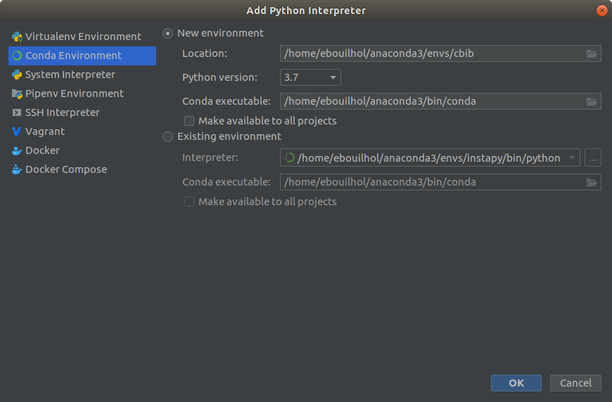

# Environements Virtuels

## Conda
Anaconda est un gestionnaire de paquet doublé d'une plateforme de développement. Il intègre a la fois la gestion d'environnements virtuels et la possibilité d'utiliser les outils tels que Spyder ou Jupyter. La documentation officielle est ici : https://docs.anaconda.com/anaconda/

### Installation
Télécharger la version correspondant a vos besoins depuis : https://www.anaconda.com/distribution/
Sous linux, mettre a jour les packages necessaires puis exécutez l'installeur précédemment téléchargé :

``` 
apt-get install libgl1-mesa-glx libegl1-mesa libxrandr2 libxrandr2 libxss1 libxcursor1 libxcomposite1 libasound2 libxi6 libxtst6
bash Anaconda3-versionxx.sh
```
### Usage
L'exemple suivant permet de créer et installer des paquets pour python 3.7 depuis un terminal :
``` 
conda create -n myEnv python=3.7
conda activate myEnv
conda install packagexx
conda install --file requirements.txt
```
### Configuration PyCharm

Depuis votre projet existant ou au démarrage d'un projet, allez dans "Project interpreter" 
(File > Settings > Project: myProject > Project interpreter) or (ctrl+maj+s > Project interpreter)

Cliquez sur l'icone paramètres puis add > Conda Environment 



Choisissez ensuite de créer un nouvel environnement ou d'utiliser un environnement existant


Primarily, Conda is tool helping to install and configure virtual environments. However, the increase in a number of available packages it also becomes a convenient package manager within the created environment. Overall, the profits of installing conda are plenty!
There are two available Conda versions - Conda and MiniConda. The first goes with the list of preinstalled packages, and the second one is bare. I prefer MiniConda to create easily reproducible environments.
### Installation

Download the installation file from https://docs.conda.io/en/latest/miniconda.html#linux-installers
```
bash Miniconda3-latest-Linux-x86_64.sh
```

After installation you should restart your shell

```
exec bash
```

by default conda activates base environment upon installation. If you prefer to activate by hand, use the following command:

```
conda config --set auto_activate_base false
```

### Usage

Now, if you have not disabled this option, you will begin in the *base* environment. You can create a new environment and configure used packages. To work on the environment you should activate it first.

```
conda create -n myenv python=3.6
conda activate myenv
```

When installing packages, you may provide custom channels with flag *-c*, from where packages will be downloaded. You may also configure other languages in the environment. Perl seems to be working decently.

```
conda install package_name
```

When you install some packages (even without conda), you may want to provide symbolic links to certain components of these packages to *bin* folder of the environment for these components to be easily callable.

```
ln -s Path_to_package/Package/Some_Script ~/miniconda/envs/your_env/bin
```

Another very useful feature of conda environments is that you can follow versions of the environment and rollback to previous versions. Here is an example:

```
$conda activate virsorter

$ conda list --revisions

rev 0
    +_libgcc_mutex-0.1 (defaults/linux-64)
    +blast-2.5.0 (bioconda/linux-64)
    +boost-1.71.0 (defaults/linux-64)
    ...
    
rev 1
    +metagene_annotator-1.0 (bioconda/linux-64)

rev 2
    +spades-3.13.0 (bioconda/linux-64)

$# Now we want to uninstall spades and all dependancies

$ conda install --revision 1

## Package Plan ##

  added / updated specs:
    - blast
    - diamond=0.9.14
    - hmmer=3.1b2
    ...

The following packages will be REMOVED:

  spades-3.13.0-0
```


## Virtualenv et virtualenvwrapper

Virtualenv est une librairie permettant de créer des environements virtuels python, cependant, la semantique de cette
librairie n'est pas très pratique, virtualenvwrapper à donc été crée pour simplifier l'usage de la librairie.

### Installation
```shell script
pip3 install virtualenv 
pip3 install virtualenvwrapper 
```

Ajouter ces lignes à la fin du fichier ~/.bashrc : 
```
export WORKON_HOME=$HOME/.virtualenvs
export PROJECT_HOME=$HOME/Devel
source /usr/local/bin/virtualenvwrapper.sh
```

Et : 
```shell script
source ~/.bashrc
```

Si après le source une erreur no such file or directory apparait : 
```shell script
sudo find / -name virtualenvwrapper.sh
```
Recopier le path du ficher dans le bashrc à la place de `/usr/local/bin/virtualenvwrapper.sh`

### Usage
```shell script
mkvirtualenv env_name # create env
workon env_name # activate env (autocompletion with tab, allow to see all availiable envs) 
deactivate # quit env
```
Une fois l'environement activé, le nom apparaît entre parenthèse en début de ligne dans le terminal : 

`(env_name) user@machine :~$`

## Pycharm

Lors de la création d'un nouveau projet dans PyCharm, cette fenêtre s'ouvre.


`Il faut surtout être attentif à la version de python selectionnée (Base Interpreter).`

L'IDE laisse également la possibilité d'utiliser un environement virtuel déjà existant.  
