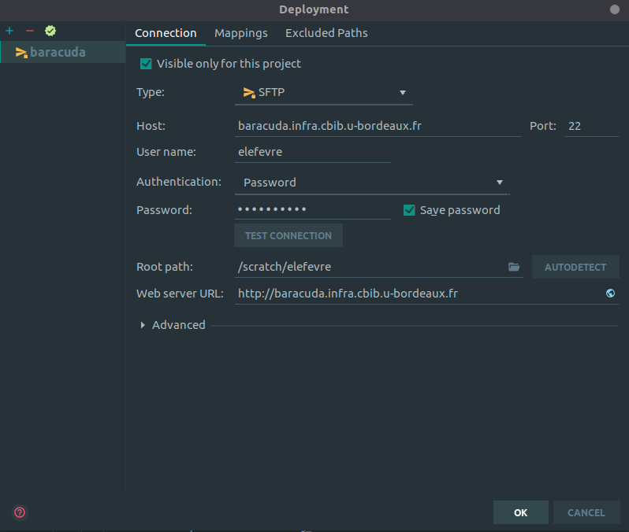

# Connect to server (bb8 or baracuda) with pycharm

Open the `Tools/Deployment/Configuration` menu.

Click on the `+` on the top left corner, then click on STFP.

A prompt will ask you for a name, you can put everything you want, this will be your entry in the menu (like baracuda in the image)

Then you just have to fill the form and test connection, if the test is successful just click on ok.

Now to have access to the files, you need do open the `Tools/Deployment/Browse Remote Host` menu and now you have a new panel (that you can move to the other side if you want) which contains the file tree of your server.

You can now editing server file from pycharm.
